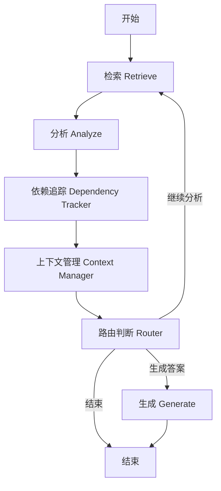

# CodeWise Agent服务

基于LangGraph的智能代码分析Agent服务，集成RAG检索和Ollama deepseek-coder-v2模型，提供多轮循环的代码分析和调用链追踪功能。

## 🚀 快速启动

### 1. 环境准备

```bash
# 激活codewise虚拟环境
conda activate codewise

# 安装依赖
cd agent
pip install -r requirements.txt
```

### 2. 依赖服务

确保以下服务正在运行：

```bash
# RAG服务 (端口8000)
cd ../rag && python start.py

# Ollama服务
ollama serve

# 下载deepseek-coder-v2模型
ollama pull deepseek-coder-v2
```

### 3. 启动Agent服务

```bash
# 使用启动脚本（推荐）
python start.py

# 或直接运行
python main.py
```

### 4. 访问服务

- **API文档**: http://127.0.0.1:8001/docs
- **服务信息**: http://127.0.0.1:8001/info
- **健康检查**: http://127.0.0.1:8001/api/v1/health
- **工作流可视化**: http://127.0.0.1:8001/api/v1/workflow-visualization

## 🏗️ 系统架构

### LangGraph工作流



### 核心组件

1. **检索节点 (Retrieve)**: 调用RAG服务搜索相关代码片段
2. **分析节点 (Analyze)**: 使用deepseek-coder-v2分析代码并提取关键信息
3. **依赖追踪节点 (Dependency Tracker)**: 构建调用链和依赖关系图
4. **上下文管理节点 (Context Manager)**: 优化和管理分析上下文
5. **路由节点 (Router)**: 决定继续分析还是生成最终答案
6. **生成节点 (Generate)**: 综合所有分析结果生成最终答案

## 📋 核心功能

### 🔍 智能代码分析
- **多种分析类型**: 函数分析、组件分析、依赖追踪、影响分析、调用链分析
- **多轮迭代**: 自动发现并追踪相关代码片段
- **上下文聚合**: 智能管理和优化分析上下文

### 🕸️ 调用链追踪
- **双向追踪**: 支持正向依赖和反向依赖追踪
- **深度控制**: 可配置的分析深度和迭代次数
- **图形化展示**: 提供调用链的结构化数据

### 🌊 流式处理
- **实时反馈**: 流式返回分析进度和中间结果
- **并发处理**: 支持批量分析请求

## 🛠️ API端点

### 核心分析

**POST** `/api/v1/analyze` - 代码分析
```json
{
  "query": "React组件中useState的使用方法",
  "analysis_type": "component_analysis",
  "max_iterations": 5
}
```

**POST** `/api/v1/analyze-stream` - 流式代码分析

**POST** `/api/v1/batch-analyze` - 批量代码分析

### 依赖分析

**POST** `/api/v1/dependency-analysis` - 依赖关系分析
```json
{
  "target": "UserProfile.jsx",
  "depth": 3,
  "include_backward": true,
  "include_forward": true
}
```

### 服务管理

**GET** `/api/v1/health` - 健康检查

**GET** `/api/v1/status` - 服务状态

**GET** `/api/v1/workflow-visualization` - 工作流可视化

## 📁 目录结构

```
agent/
├── api/                        # API层
│   ├── models.py              # 数据模型
│   └── routes.py              # 路由定义
├── clients/                   # 客户端层
│   ├── rag_client.py          # RAG服务客户端
│   └── ollama_client.py       # Ollama客户端
├── core/                      # 核心业务逻辑
│   ├── state.py               # LangGraph状态定义
│   ├── workflow.py            # 工作流定义
│   └── nodes.py               # 节点实现
├── config.py                  # 配置管理
├── main.py                    # 主程序
├── start.py                   # 启动脚本
├── test_agent.py              # 测试脚本
├── requirements.txt           # 依赖列表
└── README.md                  # 说明文档
```

## ⚙️ 配置说明

### 分析类型

- `general`: 通用分析
- `function_analysis`: 函数分析
- `component_analysis`: 组件分析  
- `dependency_tracking`: 依赖追踪
- `impact_analysis`: 影响分析
- `call_chain_analysis`: 调用链分析

### 主要配置项

```python
# 工作流配置
MAX_ITERATIONS = 10              # 最大迭代次数
MAX_CONTEXT_LENGTH = 16000       # 最大上下文长度
SIMILARITY_THRESHOLD = 0.7       # 相似度阈值

# 检索配置
INITIAL_SEARCH_TOP_K = 5         # 初始搜索结果数
DEPENDENCY_SEARCH_TOP_K = 3      # 依赖搜索结果数

# 调用链配置
MAX_CALL_CHAIN_DEPTH = 8         # 最大调用链深度
TRACK_BACKWARD_REFERENCES = True # 追踪反向引用
TRACK_FORWARD_REFERENCES = True  # 追踪正向引用
```

## 🔧 使用示例

### 1. 基本代码分析

```bash
curl -X POST "http://127.0.0.1:8001/api/v1/analyze" \
  -H "Content-Type: application/json" \
  -d '{
    "query": "useState Hook的使用方法和最佳实践",
    "analysis_type": "component_analysis",
    "max_iterations": 5
  }'
```

### 2. 依赖关系分析

```bash
curl -X POST "http://127.0.0.1:8001/api/v1/dependency-analysis" \
  -H "Content-Type: application/json" \
  -d '{
    "target": "UserProfile组件",
    "depth": 3,
    "include_backward": true,
    "include_forward": true
  }'
```

### 3. 批量分析

```bash
curl -X POST "http://127.0.0.1:8001/api/v1/batch-analyze" \
  -H "Content-Type: application/json" \
  -d '{
    "queries": [
      "React组件状态管理",
      "函数组件和类组件的区别",
      "Hook的使用规则"
    ],
    "analysis_type": "component_analysis",
    "parallel": true
  }'
```

## 🧪 测试

```bash
# 运行完整测试套件
python test_agent.py

# 检查服务健康状态
curl http://127.0.0.1:8001/api/v1/health
```

## 🔍 工作流程详解

### 多轮分析流程

1. **初始检索**: 根据用户查询搜索相关代码片段
2. **代码分析**: LLM分析代码并识别关键信息和依赖
3. **依赖发现**: 从分析结果中提取新的分析目标
4. **上下文管理**: 优化上下文，去重和排序
5. **路由决策**: 判断是否需要继续分析或生成答案
6. **循环迭代**: 根据新发现的依赖继续分析
7. **答案生成**: 综合所有分析结果生成最终答案

### 调用链追踪

- **正向追踪**: 从入口点追踪到依赖的模块和函数
- **反向追踪**: 从底层函数追踪到调用它的上层代码
- **深度控制**: 可配置的追踪深度，避免无限循环
- **去重优化**: 智能去重相似的分析路径

## 🚨 故障排除

### 常见问题

1. **RAG服务连接失败**
```bash
# 检查RAG服务是否运行
curl http://127.0.0.1:8000/api/v1/health

# 启动RAG服务
cd ../rag && python start.py
```

2. **Ollama模型不可用**
```bash
# 检查Ollama服务
ollama list

# 下载模型
ollama pull deepseek-coder-v2
```

3. **分析超时或失败**
- 减少 `max_iterations` 参数
- 检查查询是否过于复杂
- 查看日志文件 `agent_service.log`

### 性能优化

1. **减少迭代次数**: 调整 `max_iterations` 参数
2. **限制上下文**: 设置合适的 `context_window_size`
3. **并行处理**: 使用批量分析接口
4. **缓存优化**: 启用缓存功能

## 🔗 相关服务

- **RAG服务**: 向量检索和代码片段搜索
- **Parser服务**: 代码解析和知识图谱构建
- **Ollama**: 本地LLM推理服务

## 📊 监控和日志

- **服务日志**: `agent_service.log`
- **健康检查**: `/api/v1/health`
- **性能指标**: 响应时间、迭代次数、上下文大小
- **错误追踪**: 详细的错误日志和堆栈信息

## 🔮 高级功能

### 自定义分析类型
可以通过配置添加新的分析类型和对应的系统提示词。

### 工作流扩展
基于LangGraph的模块化设计，可以轻松添加新的节点和分析能力。

### 结果缓存
支持分析结果缓存，提升重复查询的响应速度。